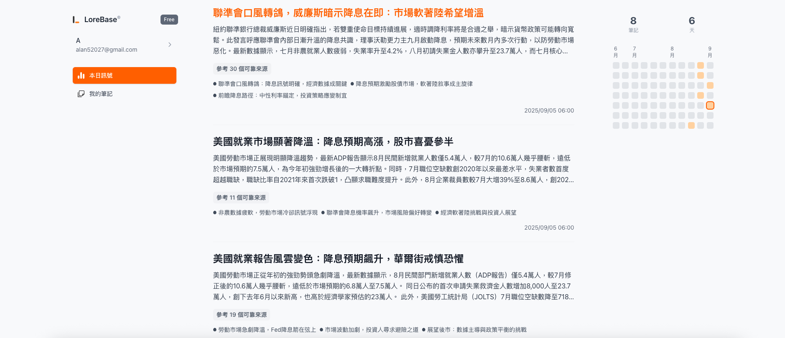

# 🏦 LoreBase — AI 驅動的財經知識助手

> 從「看完就忘」到「建立個人投資知識體系」。  
> 線上 Demo：<https://sol.zeabur.app>

  

## 💡 我們在解決什麼
投資人每天被新聞淹沒，卻難以把資訊轉成洞察。LoreBase 讓「每一篇新聞」變成「知識節點」，自動連到你的筆記與研究待辦，建立可追蹤的投資脈絡。

## ✨ 核心功能
- **AI 新聞生成**：生成完整新聞並提供參考來源
- **智慧知識連結**：新聞 ↔ 舊筆記，自動串接
- **活動熱力圖**：可視化你的研究節奏與累積

## 🧱 系統概念（高階）
- **Ingestion**：RSS/來源 → 正規化 → 去重
- **理解**：LLM 生成新聞/標註參考來源
- **向量化**：Embedding → 相似度連結個人筆記

> 這個 repo 主要作為展示與說明。**原始碼與後端服務仍在運行中**，因此不在此公開。

## 📸 介面一覽
- Dashboard（晨報 / Signals）
- News Detail（AI 摘要 / 關鍵字 / 相關筆記）
- Note Editor（重點標註＋雙向連結）
- Research Heatmap（研究活躍度）

## 🔧 主要技術（簡述）
- 前端：Next.js（App Router）、TypeScript、Tailwind
- 後端：Node/Express、Postgres（pgvector）/ 或 SQLite-vec
- AI：可插拔 LLM（本地/雲端），摘要＋關聯檢索
- 其他：RSS Pipeline、任務排程、重試與去重策略

## 👤 關於我
- Po-Yang (Alan) Hsu — 產品與全端開發  
- Email：<alanhsu0429@gmail.com> ｜ LinkedIn：<https://www.linkedin.com/in/alan890429>

## 📄 授權
本 repo 之文件與多媒體採用 **MIT License**。